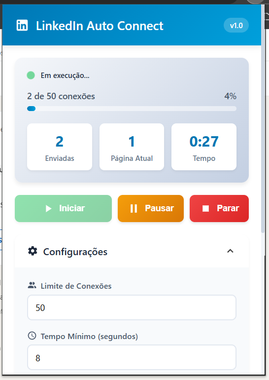

# LinkedIn Auto Connect Pro

Extensão para Chrome que automatiza o envio de convites de conexão no LinkedIn com mensagens personalizadas.



## 🚀 Funcionalidades

- ✉️ Envio automático de convites com mensagem personalizada
- ⚙️ Configurações customizáveis (delay, limite de conexões)
- ⏸️ Controles de pausa e retomada
- 📊 Interface com progresso em tempo real
- 🔄 Navegação automática entre páginas de resultados
- 💾 Salvamento automático de configurações

## 📋 Pré-requisitos

- Google Chrome (versão 88 ou superior)
- Conta no LinkedIn

## 🛠️ Instalação

1. Clone este repositório ou faça o download dos arquivos
```bash
git clone https://github.com/seu-usuario/linkedin-auto-connect.git
```

2. Abra o Google Chrome e acesse `chrome://extensions/`

3. Ative o "Modo do desenvolvedor" no canto superior direito

4. Clique em "Carregar sem compactação"

5. Selecione a pasta do projeto

6. A extensão estará instalada e pronta para uso!

## 📖 Como Usar

1. Acesse o LinkedIn e navegue até a página de busca de pessoas ou "Minha rede"

2. Clique no ícone da extensão na barra de ferramentas do Chrome

3. Configure os parâmetros desejados:
   - **Máximo de conexões**: Quantas solicitações enviar (padrão: 50)
   - **Delay mínimo/máximo**: Intervalo entre envios em segundos
   - **Mensagem personalizada**: Texto que será enviado com o convite

4. Clique em "Salvar Configurações"

5. Clique em "Iniciar" para começar a automação

6. Use os botões "Pausar" e "Parar" conforme necessário

## ⚙️ Configurações Padrão

- Máximo de conexões: 50
- Delay mínimo: 8 segundos
- Delay máximo: 20 segundos
- Mensagem padrão: Personalizável via interface

## ⚠️ Avisos Importantes

- Use com moderação para evitar restrições do LinkedIn
- O LinkedIn possui limites de convites (aprox. 100-200 por semana para contas normais)
- Delays entre 8-20 segundos ajudam a simular comportamento humano
- A automação funciona apenas em páginas com botões "Conectar" visíveis

## 🏗️ Estrutura do Projeto

```
linkedin-auto-connect/
├── manifest.json          # Configuração da extensão
├── popup.html            # Interface do usuário
├── popup.css             # Estilos da interface
├── popup.js              # Lógica da interface
├── content.js            # Script de automação
├── background.js         # Service worker
└── icons/                # Ícones da extensão
```

## 🔒 Permissões

A extensão requer as seguintes permissões:
- `activeTab`: Para interagir com a aba ativa
- `storage`: Para salvar configurações
- `scripting`: Para executar scripts no LinkedIn
- Acesso ao domínio `linkedin.com`

## 🤝 Contribuindo

Contribuições são bem-vindas! Sinta-se à vontade para:
- Reportar bugs
- Sugerir novas funcionalidades
- Enviar pull requests

## 📝 Licença

Este projeto é fornecido "como está", sem garantias. Use por sua própria conta e risco.

## ⚖️ Disclaimer

Esta ferramenta é apenas para fins educacionais e de automação pessoal. O uso desta extensão deve estar em conformidade com os Termos de Serviço do LinkedIn. O autor não se responsabiliza por qualquer uso indevido ou consequências resultantes do uso desta ferramenta.

---

**Nota**: Sempre respeite as diretrizes e limites do LinkedIn para manter sua conta em boa posição.
